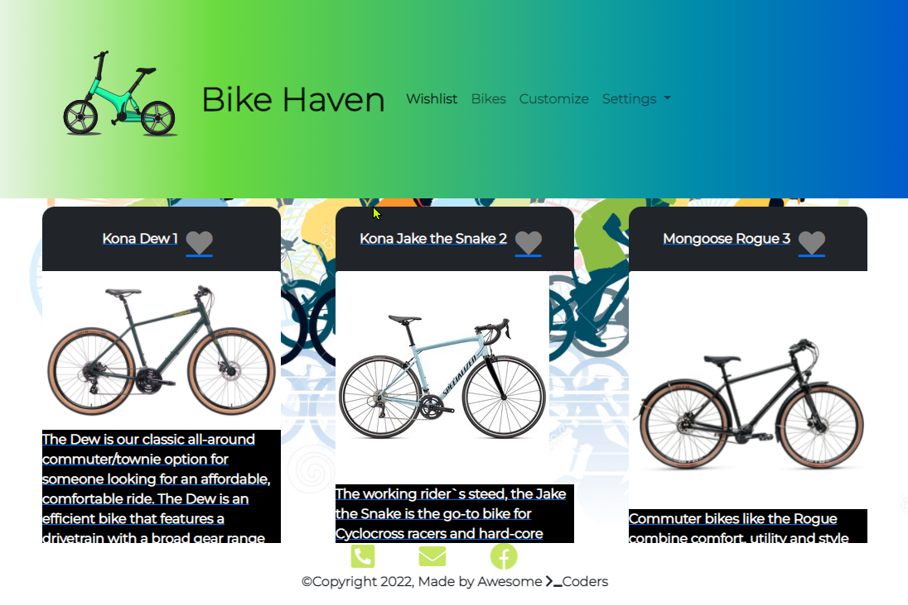

## Bike Haven
An Online Bike Store 🚲
Bike Haven is built to facilite bike customers to make an informed decision. 

## Motivation
This project was built as an Interactive Full-Stack Project for our University of Toronto's web development Codding Boot Camp. 

 
## Screenshots


## Tech/framework used
Node.js and Express.js to create a RESTful API.
Handlebars.js as the template engine.
MySQL and the Sequelize ORM for the database.
Used GET and POST routes for retrieving and adding new data.
Useed Anime.js - a lightweight JavaScript animation library. 
Has a folder structure that meets the MVC paradigm.
Included authentication (express-session and cookies).
Protected API keys and sensitive information with environment variables. dotenv
Used bcrypt

## Features
At Bike Haven you can view Featured Bikes. See Bikes and their details. Youcan add Bikes to your wish list. 
You can also Customize you Bikes. In settings you can Login and Logout. You can also maintain your profile.

## User Stories 
```
AS A BIKE STORE OWNER who sells prebuilt bikes and bike components, I WANT an online store SO THAT my customers can view bikes/parts, leave reviews, add items to shopping carts and read my blogs.


AS A Bike Customer, I WANT to explore my options, get specifications, and read reviews of different bikes, SO THAT I can make and informed decision.

```

## Acceptance Critaria 

```
GIVEN a online store/blog
WHEN I visit the Bike Haven online store 
THEN I am presented with a clean website that contains images for the user to see and a header with the options for 'wishlist, 'bikes', 'Customize'
WHEN I click on the 'wishlist' section in the header
THEN I am presented with a list of my liked items If I am logged in and have items that i've liked, otherwise I am prompted to login first
WHEN I click on the 'bikes' section 
THEN I am presented with several prebuilt bikes with bike brands that the store sells
WHEN I click on the 'Customize' section  
THEN I am teken through step by step process to select bike parts to build a custom bike
WHEN I click on a specific pre-built bike
THEN I can view more details & reviews
WHEN I click on a Heart Icon
THEN the item get added to my wishlist
``` 

## Code Organization
A folder structure that meets the MVC paradigm

## Installation
Web app already deployed ready for you to use. 
[Bike Haven Website URL](https://bike-haven.herokuapp.com/)

## Contributers 

1. Fabiola C. Gamboa 
2. Arslan Razi
3. Fabio Choi
4. Baquer Ghaddar
5. Joona Lusa
6. Vladimir Starchenko

## Credits
We would like to thank and to give credit to the class instructor and all TAs for answering our questions. 

## License
THE SOFTWARE IS PROVIDED "AS IS", WITHOUT WARRANTY OF ANY KIND, EXPRESS OR IMPLIED, INCLUDING BUT NOT LIMITED TO THE WARRANTIES OF MERCHANTABILITY, FITNESS FOR A PARTICULAR PURPOSE AND NONINFRINGEMENT. IN NO EVENT SHALL THE AUTHORS OR COPYRIGHT HOLDERS BE LIABLE FOR ANY CLAIM, DAMAGES OR OTHER LIABILITY, WHETHER IN AN ACTION OF CONTRACT, TORT OR OTHERWISE, ARISING FROM, OUT OF OR IN CONNECTION WITH THE SOFTWARE OR THE USE OR OTHER DEALINGS IN THE SOFTWARE.

